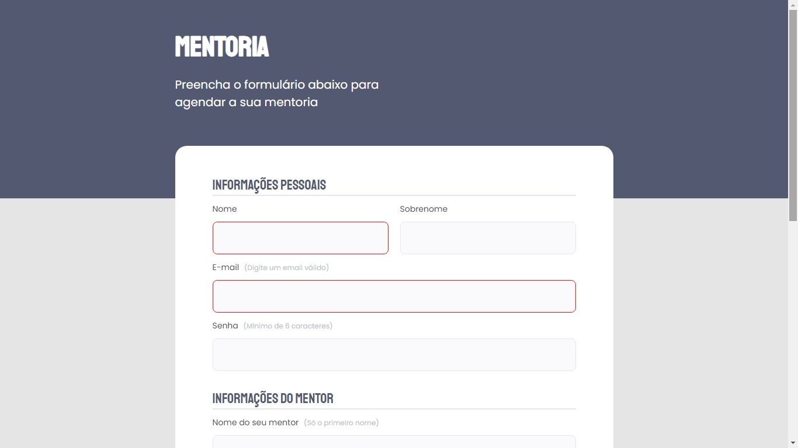

# Desafio Criando Formulários

Desafio do Stage03 que faz parte do Programa Explorer da Rocketseat  

Sabemos o quanto os nosso alunos curtem recriar um layout então temos **[mais um por aqui.](https://www.figma.com/file/fnZyJHs7eqNFAA7tUrKcsD/Stage-03---Formul%C3%A1rio-avan%C3%A7ado/duplicate)**   
Clicando no link, você encontra outra opção de formulário, um pouco mais complexa que o anterior.  

Nesse abordaremos:  

- Campo select;
- Campo checkbox;
- Imagem centralizada no header. 

## Screenshots

[🔗 Clique aqui para acessar o Projeto](https://fabiovascao.github.io/Projeto-03-Criando-Formularios-Intermediario/)  
[🔗 Clique aqui para acessar o Figma](https://www.figma.com/file/1NlokeGYBdKUQiu82C2Mlw/Stage-03---Formul%C3%A1rio-intermedi%C3%A1rio-(Copy))

## 🛠 Tecnologias

- HTML
- CSS
- Git e Github

## Autor

- [@FabioVascão](https://www.github.com/fabiovascao)